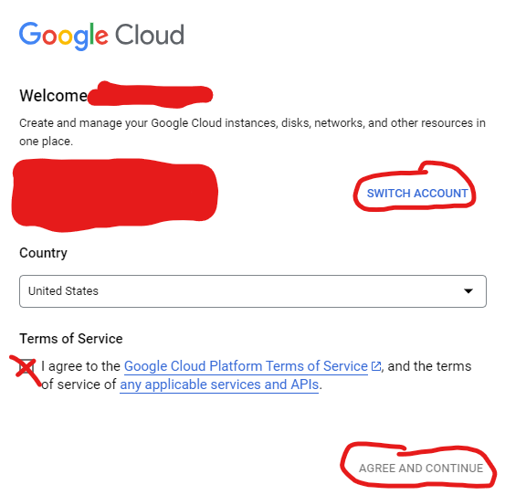
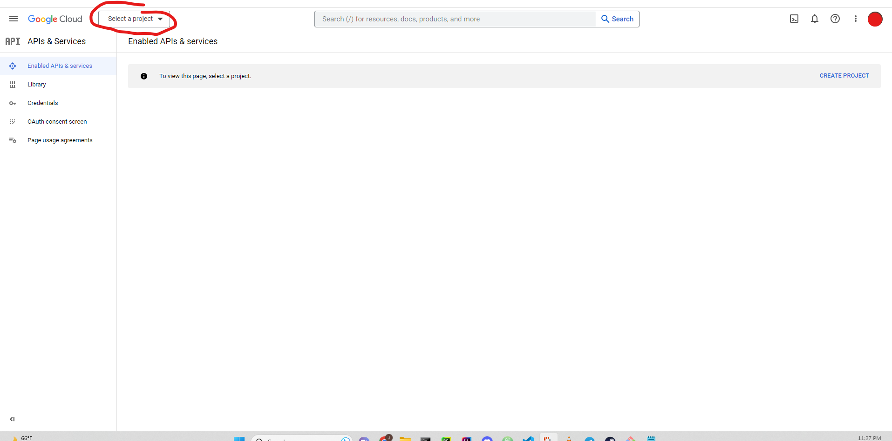
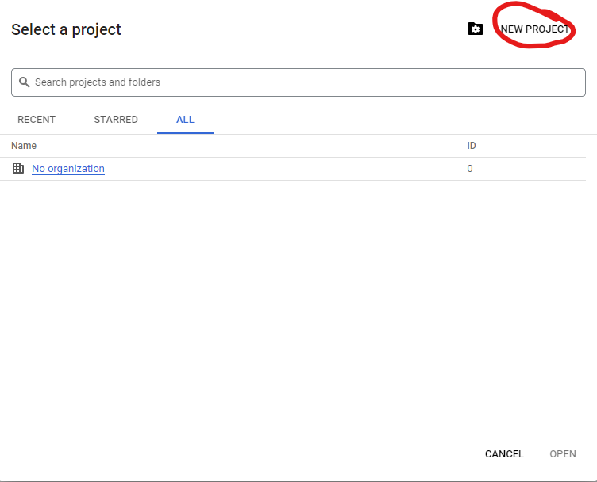
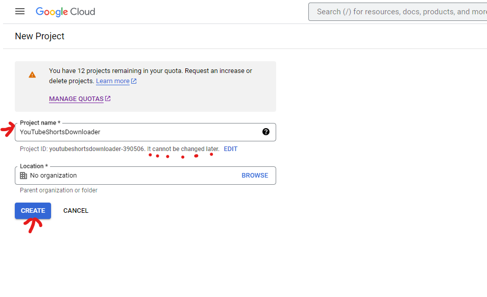
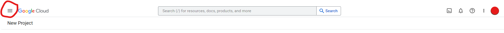
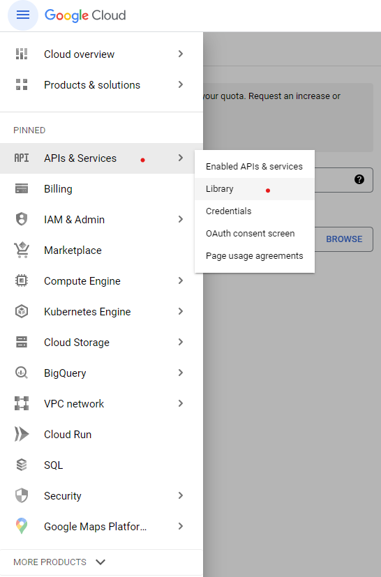
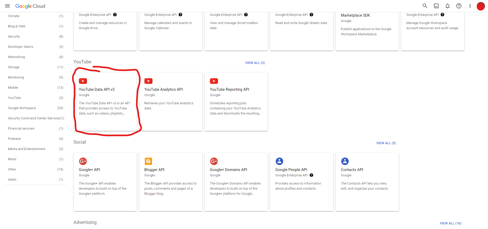
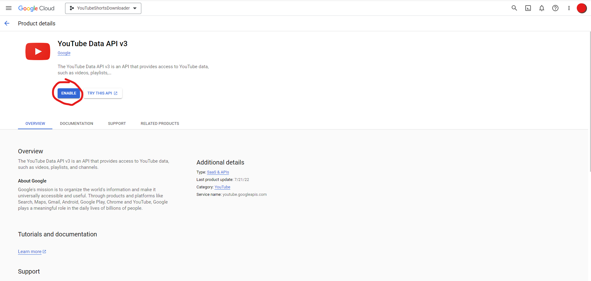
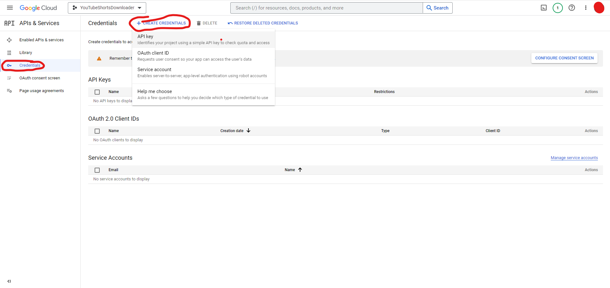

# Youtube Shorts Downloader
Download the most viewed youtube shorts of the week into mp4 files!
<br>
<br>
<p></p>


<br>

## Installing Requirements
Open a terminal in the youtube_shorts_downloader folder and run the command:

```pip install -r requirements.txt```

<p></p>
<br>

## Establishing API KEY for Youtube

Go to the Google Developers Console: [https://console.developers.google.com/](https://console.developers.google.com/)
<p></p>

### Selecting Account
You may need to select an account to use to setup your youtube API_KEY by selecting your account agreeing to terms&conditions and click **AGREE AND CONTINUE**




### New Project

Then click **Select a project** and click **NEW PROJECT**


<br>

<br>

### Name and Create New Project
Give the project a name and click **Create** don't worry about organization



### Searching For API Service
Click on the **left side bar**, then click **APIs & Service** and then click **Library**



You can either scroll down or type in the search bar to find **YouTube Data API v3** and select it


### Enable API
Click **ENABLE**


### Create Credentials
Once enabled you will then find on the left had side the tab **Credentials** click it and then click **CREATE CREDENTIALS** and click **API KEY**


### Implement API Key
The API KEY that appears will be the one you implement into your source code
